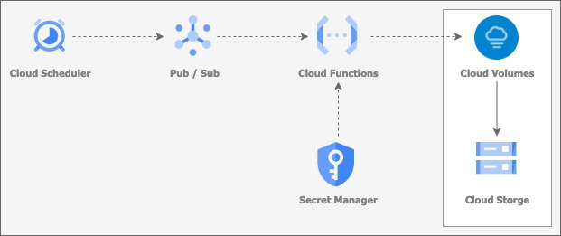
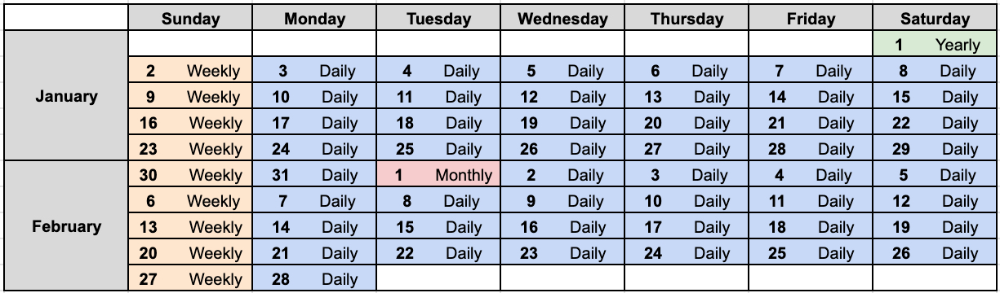
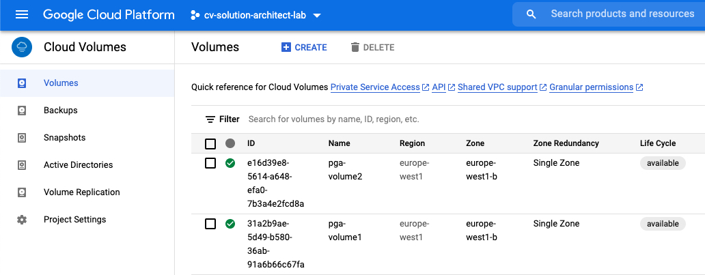
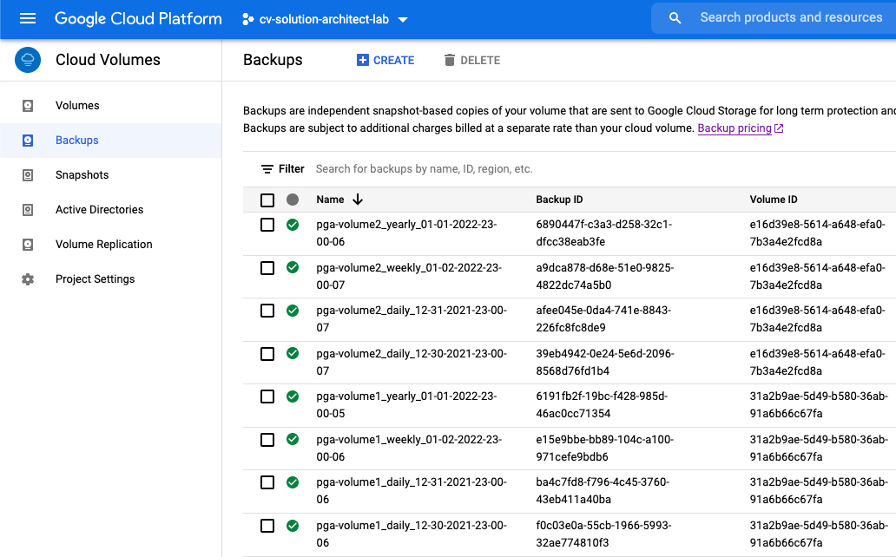

# Cloud Volumes Service backup scheduler

[Cloud Volumes Service](https://cloud.google.com/architecture/partners/netapp-cloud-volumes/overview) (CVS) on Google Cloud allows to protect your data using [snapshots](https://cloud.google.com/architecture/partners/netapp-cloud-volumes/creating-volume-snapshots) for the short-term retention and [Backup Service](https://cloud.google.com/architecture/partners/netapp-cloud-volumes/back-up) for the long-term retention. This repository includes the components to configure a scheduler and the rotation for the CVS Backup Service.

## Solution architecture

The solution is based on an event-driven serverless architecture based on Google Cloud technologies. 

### Core components

Cloud Scheduler is invoked and publishes a message to a Pub/Sub topic. This event triggers the Cloud Function. The Cloud Function requires a private key to authenticate with the Cloud Volumes Service API, which is store using Secret Manager.



### Backup scheduler and rotation

Cloud Volumes Service Backup Scheduler runs once a day and creates one backup type daily, setting a label to the backup name and an expiration based on the day it runs. There are four supported backup types, following the common grandfather-father-son scheme:

* **Yearly**: The first of January
* **Monthly**: The first of every month excluding the yearly backup
* **Weekly**: Every Sunday excluding the yearly and monthly backup
* **Daily**: Everyday excluding the yearly, monthly and weekly backup



## Deployment

This section includes a guide about how to deploy the required components of the solution.

### Pub/Sub

Create the Pub/Sub topic.

```bash
gcloud pubsub topics create cvs-backup-scheduler
```

### Cloud Scheduler

Create the Cloud scheduler using the previous Pub/Sub topic. The schedule is described using the unix-cron string format, read the [documentation](https://cloud.google.com/scheduler/docs/configuring/cron-job-schedules) to set a custom schedule. The below example shows a schedule running everyday at 9pm.

```bash

myproject='my-gcp-project-id'

gcloud scheduler jobs create pubsub cvs-backup-scheduler --schedule "0 23 * * *" \
--topic projects/$myproject/topics/cvs-backup-scheduler --message-body "none"
```

### Secret Manager

The Cloud Function requires a private key to authenticate with the Cloud Volumes Service API. Read the documentation about how to [create your service account and private key](https://cloud.google.com/architecture/partners/netapp-cloud-volumes/api#creating_your_service_account_and_private_key). The private key is stored securely in Secret Manager.


```bash
gcloud secrets create cvs-backup-scheduler --data-file=my-service-account.json
```

### Cloud Functions

The below code files are needed to deploy the python function.

```bash
mkdir cvs_backup_scheduler
cd cvs_backup_scheduler/

myurl='https://raw.githubusercontent.com/NetApp-on-Google-Cloud/cvs-backup-scheduler/main'
curl -LJO $myurl/main.py
curl -LJO $myurl/getGoogleProjectNumber.py
curl -LJO $myurl/requirements.txt
curl -LJO $myurl/env.yaml
```
Edit the **env.yaml** file and set your own values according to the [usage](#usage) section.

```bash
PROJECT_NUMBER: "my-gcp-project-id"
VOLUMES: "'abcdefgh-1234-5678-1234-abcdefgh1234,12345678-abcd-efgh-ijkl-123456789012'"
DAILY_SNAPSHOTS_TO_KEEP: "7"
WEEKLY_SNAPSHOTS_TO_KEEP: "4"
MONTHLY_SNAPSHOTS_TO_KEEP: "12"
YEARLY_SNAPSHOTS_TO_KEEP: "5"
```

The service account running the Cloud Functions needs to have the secretmanager.versions.access permission.

```bash
myserviceaccount='my-gcp-service-accountb@appspot.gserviceaccount.com'

gcloud functions deploy cvs-backup-scheduler --entry-point cvs_backup_scheduler \
--trigger-topic cvs-backup-scheduler --env-vars-file env.yaml \
--runtime python39 --timeout 180 --service-account $myserviceaccount
```

## Usage

Six arguments are needed as input:

* **PROJECT_NUMBER**: GCP project ID (e.g my-gcp-project-id) or GCP project number (e.g. 1234567890). If project ID is specified, the script needs *resourcemanager.projects.get* permissions. Otherwise use project number
* **VOLUMES**: A list of the Cloud Volumes Service IDs to back up (eg. "'abcdefgh-1234-5678-1234-abcdefgh1234,12345678-abcd-efgh-ijkl-123456789012'"). Note that currently only CVS volumes (not CVS-Performance volumes) supports backup.
* **DAILY_SNAPSHOTS_TO_KEEP**: Number of daily snapshots to keep. Set to 0 if no daily snapshots are required.
* **WEEKLY_SNAPSHOTS_TO_KEEP**: Number of weekly snapshots to keep. Set to 0 if no weekly snapshots are required.
* **MONTHLY_SNAPSHOTS_TO_KEEP**: Number of monthly snapshots to keep. Set to 0 if no monthly snapshots are required.
* **YEARLY_SNAPSHOTS_TO_KEEP**: Number of yearly snapshots to keep. Set to 0 if no yearly snapshots are required.

### Output

The backup name is based on the volume name, the backup type and a timestamp. See below an example with two volumes.



Cloud Volumes Service backup scheduler running two daily, one weekly and one yearly backup provides the below output.



## Support
This tool is not supported by NetApp or Google.

### Troubleshooting

The Cloud Functions log provides information with different severity levels.

### Getting help

Please consider to open an GitHub issue for this repository. Support is best-effort.

